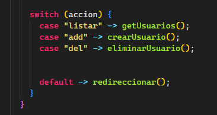

# Objetivo

- Dar un menu de bienvenida (Preferentemente con un servlet maestro que mueva a los otros 2)
- Poner estilos a los JSP
- Dar la opcion de eliminar roles y usuarios

### Dia 3 del proyecto

- La validacion de usuarios ahora esta en todos los casos

#### PARA REFERENCIA FUTURA DE MANEJO DE CRUD...
